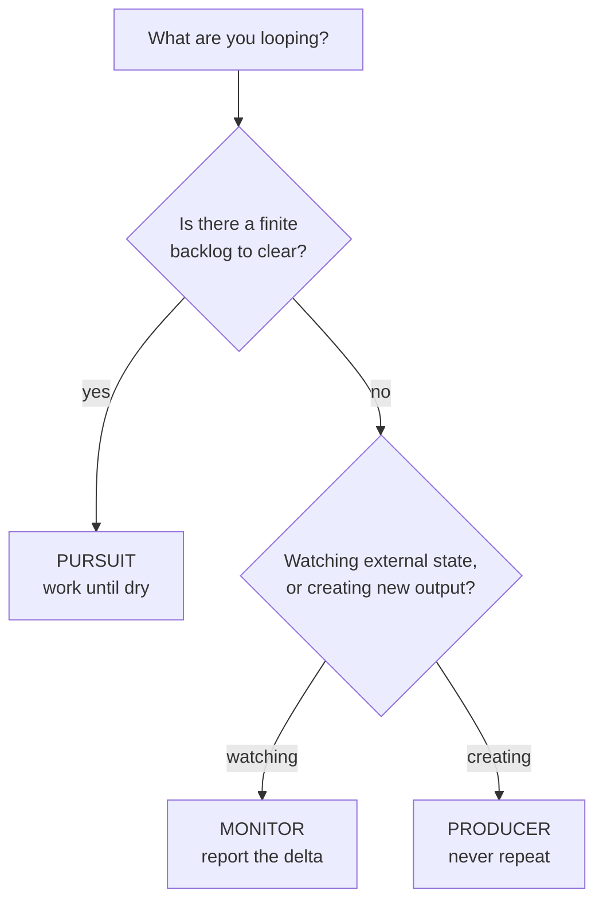

# Loop Archetypes

Nearly every useful continual workflow is one of three shapes. Pick the one that matches, then follow its pattern exactly — the failure modes are different for each.

---

## Monitor — watch for change

**Question it answers:** *"Has anything moved since last time?"*

**Skills:** `stack-check`, `secure-review`, `tool-review`, `content-review`, `community-manager` (competitor watch)

```
gate → fetch current state → record (diff vs last) → report ONLY the delta
```

### Pattern

```bash
S=loop-runner/scripts/loop-state.mjs

node $S gate stack-check --max-iterations 30 || exit 0    # exit 3 = clean stop
node stack-check/scripts/check-versions.mjs . --out /tmp/sc.json --audit
node $S record stack-check /tmp/sc.json --escalate-on critical,high
```

Then report from the delta object only.

### Failure modes

| Symptom | Cause | Fix |
|---|---|---|
| Every cycle reports "changed" | Un-stripped volatile field (timestamp, duration, scan id) | Add it to `--ignore` |
| One upgrade shows as add + remove | Version baked into the `id` | Use a version-free `id` |
| Alert fatigue | Escalating on volume instead of severity | Narrow `escalate-on` to `critical,high` |
| Noise from re-ordering | Source array order isn't stable | Sort items before emitting |

### The discipline

A monitor's success metric is **how often it stays quiet**. A monitor that speaks every cycle is a report on a timer, which is the thing you were trying to escape.

---

## Producer — create on cadence without repeating

**Question it answers:** *"What's next that I haven't done yet?"*

**Skills:** `content-plan`, `project-ideas`, `script-writer`, `social-repurpose`

```
gate → read seen-ledger → generate ONLY new items → deliver → remember
```

### Pattern

```bash
S=loop-runner/scripts/loop-state.mjs

node $S gate content-plan --max-iterations 52 || exit 0

# Which candidate topics are actually new?
node $S seen content-plan "MCP servers explained" "Claude Code tips" "AI red teaming 101"
# -> { fresh: [...], known: [...] }

# ...generate the calendar using ONLY the fresh ones...

# Commit them to the ledger once delivered — not before
node $S remember content-plan "MCP servers explained" "AI red teaming 101"
```

### The critical ordering rule

**`remember` runs after delivery, never before.** If you record a topic and then the cycle fails, that topic is permanently burned — it will never be suggested again and you'll never know why.

### Failure modes

| Symptom | Cause | Fix |
|---|---|---|
| Same topic suggested repeatedly | Ledger key isn't normalized (case, punctuation) | Normalize before hashing — lowercase, trim |
| Ideas dry up entirely | Ledger too aggressive; every near-variant burned | Key on the *concept*, not the exact title |
| Topics vanish silently | `remember` called before delivery | Move it after |

### The discipline

A producer's ledger is a **commitment**, not a cache. Once burned, a key is gone. Key on concepts, and keep keys coarse enough that a rephrasing doesn't slip through as "new."

---

## Pursuit — work a queue until dry

**Question it answers:** *"Is there anything left to do?"*

**Skills:** `vuln-triage` (planned), `prompt-injection-probe` (planned), `secure-review` remediation backlog

```
gate → read backlog → work highest-priority item → mark done → re-rank → repeat until dry
```

### Pattern

```bash
S=loop-runner/scripts/loop-state.mjs

while node $S gate vuln-triage --max-iterations 50; do
  #  1. read the queue artifact
  #  2. pick the highest-priority untriaged item
  #  3. do the work
  #  4. mark it done, emit the updated queue as the artifact
  node $S record vuln-triage /tmp/queue.json
  #  5. stop when the delta shows nothing left untriaged
done
```

### Termination

Pursuit is the only archetype that can genuinely finish. Define "dry" explicitly and check it every cycle:

- **Queue empty** → report completion and halt
- **N consecutive cycles with no progress** → halt and escalate; something is stuck
- **Iteration cap** → halt and report what remains

Loop-until-dry beats loop-until-count: a fixed `while (count < 10)` misses the tail, and a queue that refills mid-run will terminate early.

### Failure modes

| Symptom | Cause | Fix |
|---|---|---|
| Infinite loop | "Done" never marked, or re-queued each cycle | Assert the untriaged count strictly decreases |
| Works the same item forever | Priority re-ranking puts it back on top | Exclude done-items from ranking |
| Silent stall | Item fails but isn't marked failed | Track attempt counts; halt after N attempts |

### The discipline

Every cycle must **strictly reduce** the remaining queue. If a cycle ends with the same untriaged count it started with, that's a stall — halt and say so rather than burning the iteration cap.

---

## Choosing



### Combining archetypes

Some skills are legitimately two shapes at once. `secure-review` is a **monitor** for new findings and a **pursuit** over the remediation backlog. Run them as two separate loops with separate state keys — `secure-review` and `secure-review-remediation` — rather than one loop trying to do both. Separate cadences, separate escalation policies, separate stop conditions.
