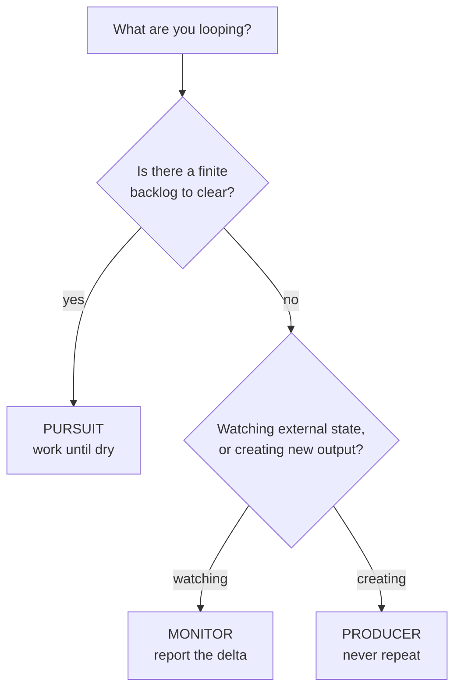

# Loop Archetypes

Nearly every useful continual workflow is one of three shapes. Pick the one that matches, then follow its pattern exactly — the failure modes are different for each.

---

## Monitor — watch for change

**Question it answers:** *"Has anything moved since last time?"*

**Skills:** `stack-check`, `secure-review`, `tool-review`, `content-review`, `community-manager` (competitor watch)

```
gate → fetch current state → record (diff vs last) → report ONLY the delta
```

### Pattern

```bash
S=loop-runner/scripts/loop-state.mjs

node $S gate stack-check --max-iterations 30 || exit 0    # exit 3 = clean stop
node stack-check/scripts/check-versions.mjs . --out /tmp/sc.json --audit
node $S record stack-check /tmp/sc.json --escalate-on critical,high
```

Then report from the delta object only.

### Failure modes

| Symptom | Cause | Fix |
|---|---|---|
| Every cycle reports "changed" | Un-stripped volatile field (timestamp, duration, scan id) | Add it to `--ignore` |
| One upgrade shows as add + remove | Version baked into the `id` | Use a version-free `id` |
| Alert fatigue | Escalating on volume instead of severity | Narrow `escalate-on` to `critical,high` |
| Noise from re-ordering | Source array order isn't stable | Sort items before emitting |

### The discipline

A monitor's success metric is **how often it stays quiet**. A monitor that speaks every cycle is a report on a timer, which is the thing you were trying to escape.

---

## Producer — create on cadence without repeating

**Question it answers:** *"What's next that I haven't done yet?"*

**Skills:** `content-plan`, `project-ideas`, `script-writer`, `social-repurpose`

```
gate → read seen-ledger → generate ONLY new items → deliver → remember
```

### Pattern

```bash
S=loop-runner/scripts/loop-state.mjs

node $S gate content-plan --max-iterations 52 || exit 0

# Which candidate topics are actually new?
node $S seen content-plan "MCP servers explained" "Claude Code tips" "AI red teaming 101"
# -> { fresh: [...], known: [...] }

# ...generate the calendar using ONLY the fresh ones...

# Commit them to the ledger once delivered — not before
node $S remember content-plan "MCP servers explained" "AI red teaming 101"
```

### The critical ordering rule

**`remember` runs after delivery, never before.** If you record a topic and then the cycle fails, that topic is permanently burned — it will never be suggested again and you'll never know why.

### Failure modes

| Symptom | Cause | Fix |
|---|---|---|
| Same topic suggested repeatedly | Ledger key isn't normalized (case, punctuation) | Normalize before hashing — lowercase, trim |
| Ideas dry up entirely | Ledger too aggressive; every near-variant burned | Key on the *concept*, not the exact title |
| Topics vanish silently | `remember` called before delivery | Move it after |

### The discipline

A producer's ledger is a **commitment**, not a cache. Once burned, a key is gone. Key on concepts, and keep keys coarse enough that a rephrasing doesn't slip through as "new."

---

## Pursuit — work a queue until dry

**Question it answers:** *"Is there anything left to do?"*

**Skills:** `vuln-triage` (planned), `prompt-injection-probe` (planned), `secure-review` remediation backlog

```
gate → read backlog → work highest-priority item → mark done → re-rank → repeat until dry
```

### Pattern

The engine manages the queue and its status lifecycle for you — you enqueue, claim, and resolve. See `LoopContract.md` §7 for the full contract.

```bash
S=loop-runner/scripts/loop-state.mjs

node $S enqueue vuln-triage sub-101 sub-102 sub-103   # seed the backlog once

while node $S gate vuln-triage --max-iterations 50; do   # exit 3 = terminal
  task=$(node $S claim vuln-triage | jq -r '.task.id // empty')
  [ -z "$task" ] && break
  #  ...do the work on $task, thoroughly...
  node $S complete vuln-triage "$task"       # verified done
  #  ...or, if you can't finish it:
  #  node $S block vuln-triage "$task" "waiting on reporter for repro steps"
done

node $S progress vuln-triage   # the terminal report — always give one
```

### Termination — end in a conclusion, never a drop-off

Pursuit is the only archetype that can genuinely finish, and it **must finish out loud.** `gate` classifies the loop in its `terminal` field; branch on it:

- **converged** (queue empty) → report the completion: what's done, what's blocked and why. This is the "ultimate conclusion."
- **interrupted** (cap / kill-switch / halt fired with work remaining) → report **loudly**: where it stopped, how many tasks remain, why. An interruption that reports is fine; one that goes silent is the failure this archetype exists to prevent.
- **working** → keep going.

The engine guarantees the queue can't spin forever: `claim` re-serves an unresolved in-progress task and auto-blocks it after `--max-attempts` (default 3), so every cycle strictly reduces the remaining count. A task is always `pending`, `in-progress`, `done`, or `blocked` — never silently abandoned.

Loop-until-dry beats loop-until-count: a fixed `while (count < 10)` misses the tail, and a queue that refills mid-run will terminate early.

### Failure modes

| Symptom | Cause | Fix |
|---|---|---|
| Infinite loop | "Done" never marked, so the task is re-served every cycle | The engine auto-blocks after `--max-attempts`; don't defeat it by never calling `complete`/`block` |
| Works the same item forever | Claiming a new task while one is still in-progress | `claim` re-serves the in-progress task first by design — resolve it before the next claim |
| Silent stall | Item fails but is never resolved | Call `block <id> <reason>` when you can't finish; the stall guard is the backstop, not the plan |
| Ends without a report | Treating gate's exit 3 as "silently done" | Branch on `gate`'s `terminal` field — converged vs interrupted — and always give the matching report |

### The discipline

Every cycle **strictly reduces** the remaining queue — the engine enforces this, but you close the loop by resolving each claimed task (`complete` or `block`) rather than leaving it hanging. And every run ends in a stated conclusion: converged (done) or interrupted (stopped here, N remain, why). A Pursuit loop that goes quiet without saying which is the one thing it must never do.

---

## Choosing



### Combining archetypes

Some skills are legitimately two shapes at once. `secure-review` is a **monitor** for new findings and a **pursuit** over the remediation backlog. Run them as two separate loops with separate state keys — `secure-review` and `secure-review-remediation` — rather than one loop trying to do both. Separate cadences, separate escalation policies, separate stop conditions.
